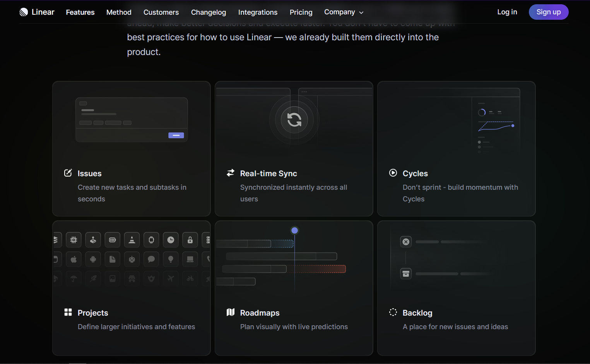

# Magic-Hover

This is a cool hover effect implemented on the Linear website: https://linear.app/

It's a website with a nice clean UI. The guy over on youtube at Hyperplexed channel recreated the hover effect. Pretty cool dude - I like his voice. 
Check out his video: https://www.youtube.com/watch?v=htGfnF1zN4g&t=56s

Here is a link to his CodePen: https://cdpn.io/MWQeYLW

I tried to follow up n make this magic hover effect...maybe I'll use this in my other projects as well.
